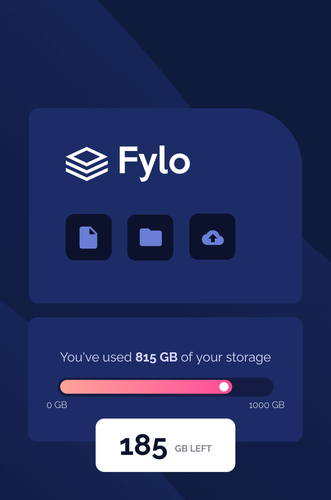

# Frontend Mentor - Fylo data storage component solution

This is a solution to the [Fylo data storage component challenge on Frontend Mentor](https://www.frontendmentor.io/challenges/fylo-data-storage-component-1dZPRbV5n). Frontend Mentor challenges help you improve your coding skills by building realistic projects. 

## Table of contents

- [Overview](#overview)
  - [The challenge](#the-challenge)
  - [Screenshot](#screenshot)
  - [Links](#links)
- [My process](#my-process)
  - [Built with](#built-with)
- [Author](#author)

## Overview

### The challenge

Users should be able to:

- View the optimal layout for the site depending on their device's screen size

### Screenshot

### Links

- Solution URL: [Solution](https://gitlab.com/bit-01/fylo-storage-component)
- Live Site URL: [Live Site](https://bit-01.gitlab.io/fylo-storage-component)

## My process

### Built with

- Semantic HTML5 markup
- CSS custom properties
- Flexbox
- Mobile-first workflow

## Author

- Website - [Bassel Aflak](https://bit01.rf.gd)
- Frontend Mentor - [@bit-01](https://www.frontendmentor.io/profile/bibt-01)
- Gitlab - [@bit-01](https://gitlab.com/bit-01)
- Instagram - [@bit_01](https://instagram.com/bit_01)
- Codepen - [@bit-01](https://codepen.io/bit-01)
